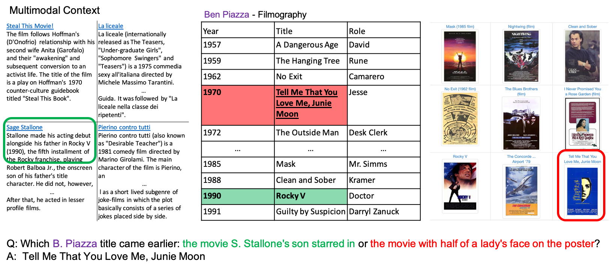

## **Cross modal questions over tables, text and images**

MultiModalQA is a challenging question answering dataset that requires joint reasoning over text, tables and images, consisting of [29,918](https://github.com/allenai/MultiModalQA)
examples. 


This dataset was created by a team of [NLP researchers](#authors) at [Tel Aviv University](https://www.tau-nlp.org/), [University of Washington](https://www.cs.washington.edu/research/nlp) and [Allen Institute for AI](https://allenai.org/).

For more details check out our ICLR21
paper ["MultiModalQA: Complex Question Answering over Text, Tables and Images"](https://openreview.net/pdf?id=ee6W5UgQLa),

<center>
    <a href="https://allenai.github.io/Break/figures/intro.png"> 
        
      </a>
</center>


## **Paper**

[**MultiModalQA: Complex Question Answering over Text, Tables and Images
**](https://arxiv.org/abs/2104.06039)  
Alon Talmor, Ori Yoran, Amnon Catav, Dan Lahav, Yizhong Wang, Akari Asai, Gabriel Ilharco, Hannaneh Hajishirzi, Jonathan Berant
*ICRL 2021*

```markdown
@inproceedings{ talmor2021multimodalqa, title={MultiModal{\{}QA{\}}: complex question answering over text, tables and images}, author={Alon
Talmor and Ori Yoran and Amnon Catav and Dan Lahav and Yizhong Wang and Akari Asai and Gabriel Ilharco and Hannaneh Hajishirzi and Jonathan
Berant}, booktitle={International Conference on Learning Representations}, year={2021}, url={https://openreview.net/forum?id=ee6W5UgQLa}
}
```

## **Download**

- For the full documentation of the dataset and its format please refer to our [Github repository](https://github.com/allenai/MultiModalQA).
- Click here to see [MultiModalQA dataset](https://github.com/allenai/MultiModalQA/dataset).
